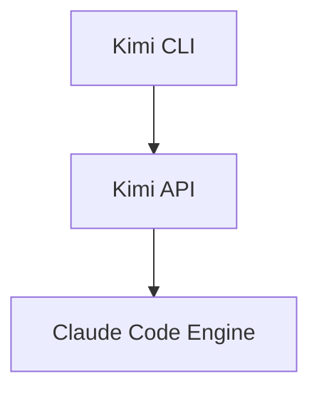

# Kimi Vision & Diagramming Skill

When the user asks to analyze an architecture or create a diagram:
1. **Analyze**: Use Kimi's vision capabilities to read screenshots of UI/Architecture.
2. **Generate**: Output raw Mermaid.js syntax or SVG code.
3. **Save**: Save the diagram to the workspace so the user can preview it locally.

Example Mermaid generation:

